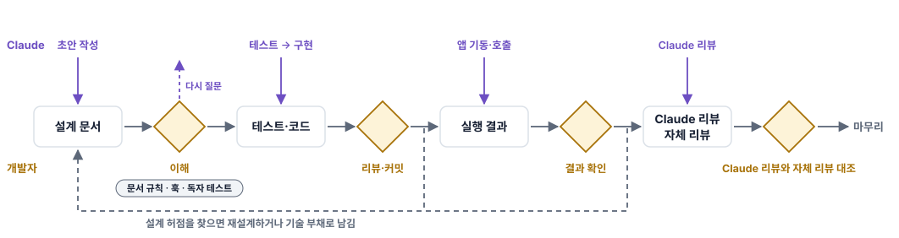

# AI 전역 작업 규칙

Claude Code 와 Codex 를 사용하며 결정한 개인 작업 규칙과 그 규칙을 실제로 적용한 공개 기록을 모았다.
2025년 9월부터 계획을 세워 이 방식으로 일해 왔다. 규칙을 정리해 공개한 것은 2026년 9월이다.

## [회고 읽기: AI와 일하며 가장 많이 고친 건 문서였다](https://ting97ok.github.io/ai-global-rules/) · 약 8분

- **원칙**: AI 가 세운 구현 계획을 온전히 이해한 뒤에 구현을 시작한다.
- **문제**: 계획 문서를 읽는 일이 병목이어서 문서 형식과 작성 규칙을 계속 수정했다.
- **한계**: 읽는 부담은 줄었다고 느끼지만 다시 질문하는 일은 늘었고 효과를 수치로 나타내지는 않았다.

## [작업 흐름 보기: AI Workflow](https://ting97ok.github.io/ai-global-rules/ai-workflow.html)

<picture>
  <source media="(prefers-color-scheme: dark)" srcset="docs/workflow-overview-dark.svg">
  
</picture>

위 그림은 전체 흐름을 한 장으로 줄인 것이다. AI Workflow 문서에는 이 흐름을 그림 여섯 장으로 나눠 절차마다 누가 무엇을 하고 어떤 훅(정해진 조건에서 반드시 실행되는 검사 스크립트)과 스킬(필요할 때만 호출해 읽는 지시 파일)이 적용되는지 그림으로 설명했다.

## 검증 기록

| 규칙 | 공개 기록 |
|---|---|
| 테스트 하나와 구현 하나를 번갈아 커밋한다 | 이 저장소 [PR #4](https://github.com/Ting97ok/ai-global-rules/pull/4) 의 커밋 목록 `hotdeal-commerce` [82a62aa](https://github.com/Ting97ok/hotdeal-commerce/commit/82a62aaf5ecbe69c62ccef263f0d05f2326b6aac) → [78982d6](https://github.com/Ting97ok/hotdeal-commerce/commit/78982d6912fff9c3fa9ee1e7f9ad643d5741c8a1) |
| 작업 단위가 끝나면 앱을 기동해 외부에서 호출한다 | `hotdeal-commerce` [PR #6](https://github.com/Ting97ok/hotdeal-commerce/pull/6) 본문의 「인수 확인」 |

`hotdeal-commerce` 의 두 커밋은 `confirm` 응답에서 결제 완료(`DONE`)와 결과 미확정(`IN_DOUBT`)을 구분한 변경이다. 테스트 커밋이 단언을 먼저 추가하고 구현 커밋이 `ConfirmPaymentResponse` 에 `status` 필드를 추가했다.

리뷰로 방향이 바뀌면 댓글을 먼저 게시하고 커밋한다는 규칙은 아직 공개 사례로 제시하지 못했다.

이 저장소 자체의 검사도 공개한다. [훅 테스트](claude/hooks/tests/)가 문서 작성 스킬 호출 누락, [독자 테스트](#자동-검사-범위) 없는 문서 커밋, 테스트가 실패한 상태의 커밋 명령을 검사하고 [Codex 연결 테스트](tests/codex-sync.test.sh)가 링크와 덮어쓰기 방지를, [권한 규칙 테스트](tests/codex-rules.test.sh)가 Codex 에서 차단해야 하는 명령을 검사한다.

[이 작업 방식이 만들어진 과정과 남은 고민 읽기](https://ting97ok.github.io/ai-global-rules/)

## 자동 검사 범위

규칙 문서만으로는 지시를 강제할 수 없다. 훅은 정해진 조건에서 실행된다. 그래서 반드시 지켜야 할 항목은 훅으로 검사한다. 되돌리기 어려운 명령은 권한 규칙으로 차단한다. `git -C 경로 reset` 처럼 전역 옵션을 준 git 명령도 차단한다.

심층 인터뷰는 Claude 가 문서를 작성하거나 수정하기 전에 누가 읽을 문서인지와 문체, 담을 내용을 개발자에게 질문하는 절차다. 독자 테스트는 문서 사본만 읽는 Codex 에 질문에 답하게 해 빠진 설명과 필요 없는 글을 찾는 절차다. 둘 다 [doc-writing](claude/skills/doc-writing/SKILL.md) 에 기록되어 있다.

아래 표는 Claude 작업에서 각 훅이 검사하는 항목이다. Codex 에서 달라지는 점은 아래 접힌 절에 있다.

| 훅 | 검사하는 것 |
|---|---|
| `git-guard.py` | `git add -A`, 커밋 접두사, AI 도구 서명(`Co-Authored-By: Claude` 같은 줄), 병합 방식, PR 본문 항목 |
| `commit-checkpoint.py` | 테스트가 통과했는데 커밋하지 않은 변경이 남은 상태. 이번 세션에서 수정한 파일만 센다 |
| `stop-check.py` | 개발자에게 조회 명령 실행 요청, 상태 확인 없는 커밋 명령, 테스트가 실패한 상태의 커밋 명령, 새로 작성하거나 크게 수정한 문서를 독자 테스트 없이 커밋하려는 것, 교차 검증의 Codex 작업을 기록 도구 없이 호출한 것, 기록한 교차 검증 항목을 답변에 보고하지 않은 것 |
| `prose-check.py` | 문서의 전각 대시 문장 연결, 표 칸 한 조각의 두 문장, 연결어미(지만·는데·면서) 뒤 쉼표, 질문형 제목, 제목 속 개수 |
| `doc-skill-guard.py` | 문서를 작성하거나 수정하기 전에 `doc-writing` 과 심층 인터뷰 스킬을 호출했는지. 확장자와 내용으로 문서를 구분하고 셸 명령으로 수정할 때도 확인한다 |
| `memory-note.py` | 메모리에 둘 내용인지 다시 확인하게 한다 |
| `agent-guard.py` | 서브에이전트 호출에 모델을 지정하는 것 |

훅은 정해진 입력과 패턴을 검사한다. PR 에 「인수 확인」 항목이 있는지는 확인하지만 기록된 결과가 맞는지까지 판단하지는 않는다. 설계의 타당성과 검증 결과는 내가 직접 검토한다.

Codex 적용 범위와 테스트 실행

전역 규칙과 스킬, 훅은 `~/.claude` 에 한 벌만 둔다. Codex 가 읽는 위치에는 그 원본을 가리키는 링크를 생성한다. [codex-sync.sh](codex-sync.sh) 가 `~/.codex/AGENTS.md`, `~/.agents/skills/`, `~/.codex/hooks/` 에 링크를 생성한다. 링크한 파일은 사본이 없어서 원본을 수정하면 Codex 쪽도 함께 바뀐다.

처음에는 복사했다. 저장소마다 둔 `AGENTS.md` 사본에서 치환이 틀려 `~/.Codex/` 라는 없는 경로를 가리키는 것을 발견하고 링크로 변경했다.

훅은 등록 경로를 그대로 두고 파일만 링크로 연결한다. Codex 는 훅 명령 문자열을 기준으로 신뢰 승인을 기록한다. `hooks.json` 의 경로를 바꾸면 승인이 해제되고 알림 없이 훅이 실행되지 않는다.

사본으로 남는 것은 둘이다. `codex-sync.sh` 가 `settings.json` 에서 훅 설정을 읽어 훅 등록 파일 `hooks.json` 을 생성한다. 권한 규칙은 이 저장소의 [codex/claude-deny.rules](codex/claude-deny.rules) 가 원본이다. `codex-sync.sh` 는 이 둘을 Codex 쪽에서 수정했는지 확인한다. 수정한 것이 있으면 바뀔 목록을 보여 주고 멈춘다. 확인한 뒤 `-f` 를 지정하면 덮어쓴다.

`codex-cross-check` 스킬은 링크하지 않는다. Codex 가 자기 자신에게 교차 검증을 요청하게 된다.

전역 규칙이 링크라 Claude 전용 문장을 제외할 수 없다. 교차 검증, `doc-skill-guard`, 독자 테스트 확인 세 줄이 그렇다. `developer_instructions` 는 Codex 에 항상 전달할 지시를 기록하는 `config.toml` 항목이다. 이 항목에 세 줄이 Codex 에는 해당하지 않는다고 기록한다.

`git-guard.py` 는 Claude Code 와 Codex 가 훅에 전달한 셸 명령을 그대로 검사한다. Codex 도 명령을 그대로 전달해서 처음부터 동작했다. `stop-check.py` 는 대화 기록에서 명령을 추출한다. Codex 는 명령을 `exec_command({cmd:"…"})` 로 감싸 기록한다. `prose-check.py` 와 `memory-note.py` 는 훅에 전달되는 변경 내용에서 수정한 파일 경로를 추출한다. Codex 는 그 경로를 `*** Update File:` 줄에 기록한다.

| 훅 | Codex |
|---|---|
| `git-guard.py` | 동작한다 |
| `stop-check.py` | 동작한다. 독자 테스트 확인은 Claude 대화 기록만 읽어 Codex 에서는 확인하지 않는다 |
| `prose-check.py` | 동작한다 |
| `memory-note.py` | 동작한다 |
| `commit-checkpoint.py` | 동작한다. 대화 기록이 없어 세션 전부터 있던 변경도 센다 |
| `agent-guard.py` | Claude 가 서브에이전트를 호출할 때 사용하는 `Agent` 도구를 검사하는 훅이다 |
| `doc-skill-guard.py` | 등록하지 않는다. Claude 의 스킬 호출 기록에 기대는 훅이다 |

표의 「동작한다」는 실제 Codex 세션을 실행해 확인한 것이다. 테스트만으로는 훅이 호출되는지까지 알 수 없다.

Codex 에서는 AGENTS.md 가 문서 작업에 스킬을 먼저 호출하라고 지시한다. 누락을 자동으로 차단하지는 않는다.

되돌리기 어려운 명령은 훅이 아니라 권한 규칙으로 차단한다. [codex/claude-deny.rules](codex/claude-deny.rules) 가 `~/.codex/rules/` 로 들어가 `git reset`·`git clean`·`rm -rf` 등 열한 가지를 거절한다. 거절할 때 규칙에 기록한 이유를 그대로 보여 준다. 인자를 앞에서부터 비교하는 방식이라 플래그가 올 수 있는 위치를 하나씩 기록해야 한다. `git push mirror --force` 처럼 원격 이름이 다른 것은 차단하지 못한다. 차단하지 못하는 명령은 규칙 파일 끝에 기록했다. git 전역 옵션이 오면 하위 명령의 자리가 달라져 규칙에 미리 기록할 수 없다. 그래서 `git -C`·`git -c`·`git --no-pager` 로 시작하는 명령은 거절하지 않고 실행 전에 개발자에게 승인을 요청한다.

저장소마다 결정한 규칙은 사본을 만들지 않는다. `config.toml` 에 `project_doc_fallback_filenames = ["CLAUDE.md"]` 를 두면 Codex 가 그 저장소의 `CLAUDE.md` 를 직접 읽는다. 사본을 두면 원본을 수정해도 사본은 갱신되지 않는다. 설정이 빠졌는지는 `codex-sync.sh` 가 확인한다.

테스트는 파일을 하나씩 직접 실행한다. 훅은 `claude/hooks/tests/test_*.py` 여섯 개를 `python3 claude/hooks/tests/test_stop_check.py` 처럼 실행한다. Codex 연결은 `sh tests/codex-sync.test.sh`, 권한 규칙은 `sh tests/codex-rules.test.sh`, 복사 스크립트는 `sh tests/sync.test.sh` 다.

## 공개 파일

규칙 문서와 스킬, 규칙을 검사하는 훅과 테스트, 두 도구가 같은 원본을 보게 하는 스크립트, 문서 그림 생성기가 들어 있다.

| 파일 | 내용 |
|---|---|
| [claude/CLAUDE.md](claude/CLAUDE.md) | 전역 규칙. Claude Code 의 모든 세션에 들어가며 Codex 는 링크로 같은 원본을 읽는다 |
| [claude/skills/doc-writing/](claude/skills/doc-writing/SKILL.md) | 문서 작성 규칙. 문서 작업이면 이름을 지정하지 않아도 Claude 와 Codex 가 호출한다 |
| [claude/skills/doc-writing/render-check.js](claude/skills/doc-writing/render-check.js) | 슬라이드 렌더 결함(넘침·잘림·바닥 여백·겹침)을 측정하는 스크립트 |
| [claude/skills/codex-cross-check/](claude/skills/codex-cross-check/SKILL.md) | Claude 와 Codex 가 같은 질문에 따로 답하고 결과를 대조하는 교차 검증 절차 |
| [claude/skills/spring-conventions/](claude/skills/spring-conventions/SKILL.md) | Spring·JPA 계층별 코드와 테스트 규칙 |
| [claude/hooks/](claude/hooks/) | 규칙을 검사하는 훅과 그 테스트 |
| [claude/settings.json](claude/settings.json) | 훅 등록과 차단 명령 목록. 설정 네 항목(권한·훅·사용 플러그인·추가 플러그인을 찾는 저장소)만 발췌한다 |
| [codex/claude-deny.rules](codex/claude-deny.rules) | Codex 가 거절할 명령 목록 |
| [sync.sh](sync.sh) | 로컬 원본을 이 저장소로 복사한다 |
| [codex-sync.sh](codex-sync.sh) | Codex 가 읽는 위치에서 로컬 원본으로 링크를 생성한다 |
| [tools/](tools/) | 문서 그림 생성기. AI Workflow 의 흐름 그림과 장치 설명, 회고와 README 의 개요 그림을 생성하고 렌더링 결과를 측정한다 |

## 공개 범위

- 문서 초안은 AI 가 작성하고 내가 검토한다. 채택한 설계와 변경 내용은 내가 책임지고 커밋과 푸시도 직접 한다.
- 설정은 권한·훅·사용 플러그인·추가 플러그인을 찾는 저장소를 지정하는 네 항목(`permissions`, `hooks`, `enabledPlugins`, `extraKnownMarketplaces`)만 발췌한다. 인증 정보와 대화 기록, 메모리는 공개하지 않는다.
- 외부에서 가져온 스킬은 이 저장소에 포함하지 않고 출처로 연결한다. [mattpocock/skills](https://github.com/mattpocock/skills), IntelliJ 의 `ij-debugger`. grill-me 는 mattpocock/skills 원문에 문서를 작성하기 전에 독자부터 질문하는 규칙을 추가했다. grill-with-docs 는 한국어로 다시 작성했다. 마크다운 `CONTEXT.md` 와 번호 ADR 파일 대신 CLAUDE.md 가 지정한 결정·용어 문서를 읽어 대조한다. CLAUDE.md 가 형식을 지정하지 않았으면 결정은 HTML 결정 문서의 절로, 용어 정의는 그 용어를 처음 정의하는 절의 첫 문단으로 기록한다. ij-debugger 는 IntelliJ IDEA 가 설치한 그대로 사용한다.
- 회사 업무용 규칙과 사내 저장소 내용은 포함하지 않는다.
- 작업 시간이나 결함이 얼마나 줄었는지는 측정하지 않았다. 효과를 수치로 제시하지 않는다. 회고에 기록한 수치는 독자 테스트 한 번의 비용과 검토 결과다.
